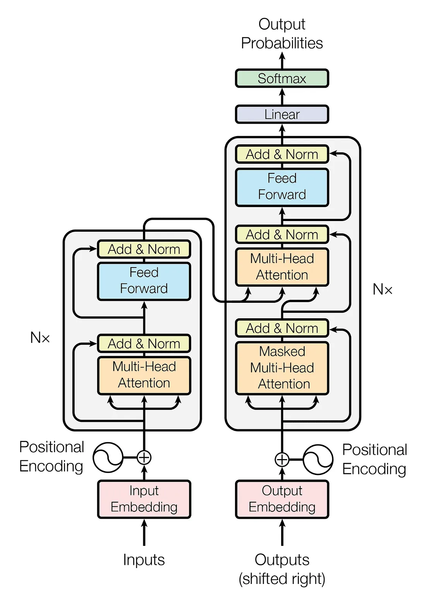

# Attention_From_Scratch

# **SimpleAttention: A Beginner’s Guide to Building an Attention Model**  
**A simplified implementation of the "Attention Is All You Need" paper.**  
This project walks you through creating a basic Attention-based model from scratch. If you're curious about how modern deep learning models like Transformers work, this is a great place to start!

---

## 🌟 What You’ll Learn  
- **Self-Attention:** The magic behind how models focus on the most important parts of input sequences.  
- **Multi-Head Attention:** How multiple attention "heads" improve the model’s performance.  
- **Positional Encoding:** Why and how we give the model a sense of order in sequences.  
- **Customizable Architecture:** Adjust the number of layers and attention heads to experiment with the model’s complexity.

---
## 🖼️ Transformer Architecture Diagram



Source: [Attention Is All You Need](https://arxiv.org/abs/1706.03762)

---
## 📚 What’s Inside  
- **Core Attention Module:** The building block of the Transformer.  
- **Simple and Clean Code:** Written with beginners in mind, using clear and well-commented code.  
- **Dataset Flexibility:** Works with text datasets like IMDB reviews or your own custom data.

---

## 🚀 How to Get Started  
1. Clone the repository and install dependencies.  
2. Train your own Attention-based model on any text dataset!  

```bash
git clone https://github.com/saeidtaleghani23/Attention_From_Scratch.git
cd Attention_From_Scratch
conda env create -f ./env/environment.yml
conda activate transformer_env
python train.py
```
3. Then, you can test your trained model and see some example sentences and their translation.
```bash
python test_model.py
```

## 📖 References
- [Attention Is All You Need](https://arxiv.org/abs/1706.03762)  
- [PyTorch Documentation](https://pytorch.org/docs/stable/index.html)

---
# Language Translation Web Application

This part is a Flask-based language translation application that utilizes a pre-trained transformer model for translation. 
The application takes an English sentence as input and returns the translated French sentence.

## Running the Application with Docker
Docker allows you to run the application in a containerized environment, ensuring it runs seamlessly across different systems.

### Prerequisites

- **Docker**: You need Docker installed on your machine to build and run the container. Follow the instructions on the official Docker [installation guide](https://docs.docker.com/get-docker/) if you haven't already installed Docker.

### Steps to Run the Application
1. **Clone the Repository**

   If you haven’t cloned the repository yet, do so by running:

   ```bash
   git clone https://github.com/saeidtaleghani23/Attention_From_Scratch.git
   cd Attention_From_Scratch
   ```

2. **Build the Docker Image**
    
    In the root directory of the project (where the Dockerfile is located), build the Docker image by running the following command:
    ```bash
    docker build -t flask-translator .
    ```
    This will create a Docker image named ``flask-translator``.

3. **Run the Docker Container**
    
    Once the image is built, run the Docker container with the following command:
    ```bash
    docker run -p 5000:5000 flask-translator
    ```
    This command maps port 5000 on your local machine to port 5000 in the Docker container, where the Flask application will be accessible.

4. **Access the Application**
    
    Open your browser and go to ``http://localhost:5000`` to interact with the translation app.
    You can input a sentence for translation and see the translated output.

